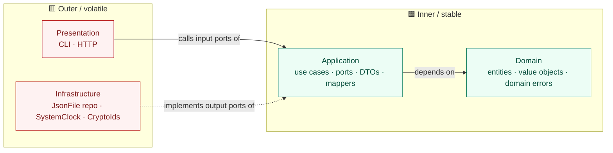
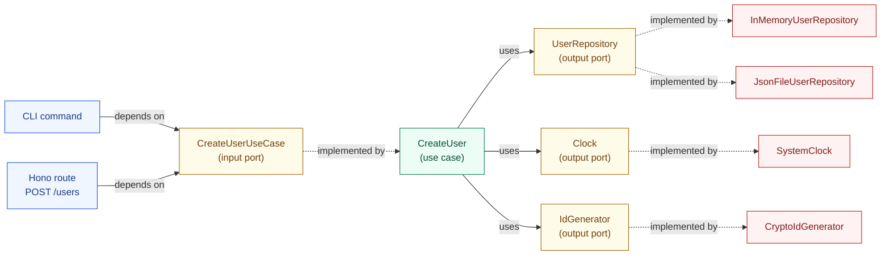
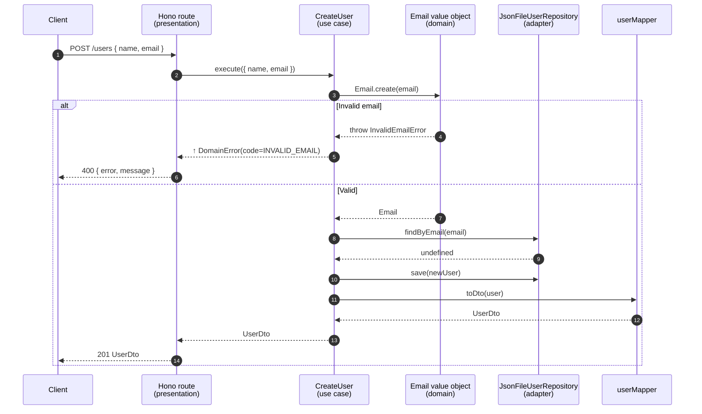

# 🧱 Clean Architecture Template

A TypeScript + Node.js (ESM) template that scaffolds a project around **Clean Architecture** / **Ports & Adapters**. Fork it as a base for new services, APIs, CLIs, or workers.

> **Read `AGENTS.md` before contributing.** It is the binding contract for layer boundaries and forbidden patterns.

---

## 🎯 Goals

- Keep business rules independent from frameworks, databases, and transports.
- Enforce **dependency inversion**: outer layers depend on inner layers, never the reverse.
- Make swapping infrastructure (DB, HTTP framework, message bus) a localized change.
- Demonstrate **every** Clean Architecture concept in working code: entities, value objects, use cases, input ports, output ports, DTOs, mappers, multiple adapters, two delivery mechanisms, and a single composition root per delivery.

---

## 🧩 The four layers

```
src/
├── domain/         ← Enterprise business rules
│   ├── shared/         · DomainError base class
│   └── user/           · User entity, Email value object, domain errors
├── application/    ← Use cases, ports, DTOs (no I/O, no frameworks)
│   ├── dtos/           · UserDto (primitives only)
│   ├── mappers/        · userMapper (entity → DTO)
│   ├── ports/
│   │   ├── input/      · use-case interfaces (driving side)
│   │   └── output/     · repository / clock / id-generator (driven side)
│   └── use-cases/      · CreateUser, GetUser, ListUsers
├── infrastructure/ ← Adapters that implement output ports
│   ├── clock/          · SystemClock
│   ├── id/             · CryptoIdGenerator
│   └── persistence/    · InMemoryUserRepository, JsonFileUserRepository
├── presentation/   ← Delivery mechanisms (drive the input ports)
│   ├── cli/            · argv dispatcher + commands
│   └── http/           · Hono server + routes
├── index.ts        ← CLI composition root
└── server.ts       ← HTTP composition root
```

### Dependency direction



**Rule:** source-code dependencies always point inward. Inner layers know nothing about outer layers — they expose **ports** (interfaces) and outer layers **implement** them.

---

## 🔌 Ports & Adapters for the User slice



The use case sits **inside** the application layer. It only sees the ports — the dotted lines show implementations swapped in at the composition root. That's why the same `CreateUser` works under CLI or HTTP, against an in-memory store or a JSON file, with no code changes.

---

## ⚡ Request flow: `POST /users`



Notice that `Route` only ever speaks to `UC` via its input port and to `Client` via DTOs / `DomainError.code`. The route knows nothing about `JsonFileUserRepository`, `Email`, or `User`.

---

## ✨ What's included

- ⚡ TypeScript + Node.js ESM
- 🧪 Vitest for fast, native ESM testing (29 tests across all layers)
- 🧹 XO + Prettier (config tuned for ESM CLI/server entry points)
- 🪝 Husky + lint-staged pre-commit
- 🪪 `node:util.parseArgs` CLI dispatcher (zero deps)
- 🌐 [Hono](https://hono.dev) + `@hono/node-server` HTTP delivery
- 🧭 Layer-scoped import aliases (`#domain/*`, `#application/*`, `#infrastructure/*`, `#presentation/*`)

---

## 📋 Requirements

- Node.js 18+

## 🛠️ Setup

```bash
npm install
```

## ▶️ Scripts

| Script           | What it does                                  |
| ---------------- | --------------------------------------------- |
| `npm start`      | Run the CLI composition root (`src/index.ts`) |
| `npm run serve`  | Run the HTTP composition root on port 3000    |
| `npm test`       | Run Vitest tests                              |
| `npm run lint`   | Lint with XO (autofix)                        |
| `npm run format` | Format with Prettier                          |

---

## 💻 CLI usage

Persistence defaults to `./.data/users.json`. Override with `USERS_DATA_FILE=/path/to/users.json`.

```bash
npm start -- create-user --name "Alice" --email "alice@example.com"
npm start -- list-users
npm start -- get-user <id>
npm start -- help
```

> The `--` separates npm's args from the CLI's args. With `tsx` directly: `tsx src/index.ts list-users`.

Domain errors map to non-zero exit codes:

```bash
$ npm start -- get-user does-not-exist
Error [USER_NOT_FOUND]: User not found: does-not-exist
$ echo $?
1
```

## 🌐 HTTP usage

```bash
npm run serve
# HTTP server listening on http://localhost:3000
```

| Method | Path         | Body                  | Success         | Errors                                                             |
| ------ | ------------ | --------------------- | --------------- | ------------------------------------------------------------------ |
| POST   | `/users`     | `{ "name", "email" }` | `201 UserDto`   | `400 INVALID_EMAIL`, `409 EMAIL_ALREADY_EXISTS`, `400 BAD_REQUEST` |
| GET    | `/users`     | —                     | `200 UserDto[]` | —                                                                  |
| GET    | `/users/:id` | —                     | `200 UserDto`   | `404 USER_NOT_FOUND`                                               |

```bash
curl -X POST http://localhost:3000/users \
  -H "content-type: application/json" \
  -d '{"name":"Alice","email":"alice@example.com"}'
# → 201 {"id":"…","name":"Alice","email":"alice@example.com","createdAt":"…"}

curl http://localhost:3000/users
# → 200 [{...}]
```

Status mapping is centralized in `src/presentation/http/server.ts` — extend the `statusByCode` map when you add new domain error codes.

---

## 🧭 Path aliases

| Alias               | Maps to                |
| ------------------- | ---------------------- |
| `#domain/*`         | `src/domain/*`         |
| `#application/*`    | `src/application/*`    |
| `#infrastructure/*` | `src/infrastructure/*` |
| `#presentation/*`   | `src/presentation/*`   |
| `#src/*`            | `src/*`                |

Use `.js` import specifiers in TypeScript source (Node ESM resolution). Example:

```ts
import { CreateUser } from "#application/use-cases/create-user.js";
```

---

## 🧪 Testing strategy

| Layer          | What to test                                                | How                                                                        |
| -------------- | ----------------------------------------------------------- | -------------------------------------------------------------------------- |
| Domain         | Value-object validation, entity invariants, error semantics | Pure unit tests; no doubles                                                |
| Application    | Use-case orchestration                                      | Drive via input port; in-memory repo + hand-rolled `Clock` / `IdGenerator` |
| Infrastructure | Adapter behavior                                            | Integration test against the real fs / DB                                  |
| Presentation   | Routing, status mapping, arg parsing                        | Stub the input ports with fake use cases                                   |

Tests live mirroring `src/`:

```
tests/
├── domain/
│   └── email.test.ts
├── application/
│   ├── create-user.test.ts
│   ├── get-user.test.ts
│   └── list-users.test.ts
└── presentation/
    ├── cli/
    │   ├── cli.test.ts
    │   └── commands/
    │       ├── create-user.test.ts
    │       ├── get-user.test.ts
    │       └── list-users.test.ts
    └── http/
        └── server.test.ts
```

Presentation tests use `app.request(...)` (Hono) and `console.*` spies (CLI) to drive routes / commands through fake input ports — proving the input-port abstraction holds without booting a server or shelling out.

---

## 🚀 Using as a template

1. Click **Use this template** on GitHub (or `git clone` and re-init).
2. Update `name`, `description`, and repo URLs in `package.json`.
3. Replace the `User` slice with your own bounded context (see `AGENTS.md` §4 for recipes).
4. Add infrastructure adapters as needed — Postgres, Redis, S3, message brokers all become new files in `src/infrastructure/`.
5. Add or replace a delivery mechanism — gRPC, WebSocket, queue worker — as a new folder in `src/presentation/` and a new composition root at `src/<name>.ts`.

For the full set of rules each contributor (human or AI) must follow, see [`AGENTS.md`](./AGENTS.md).
